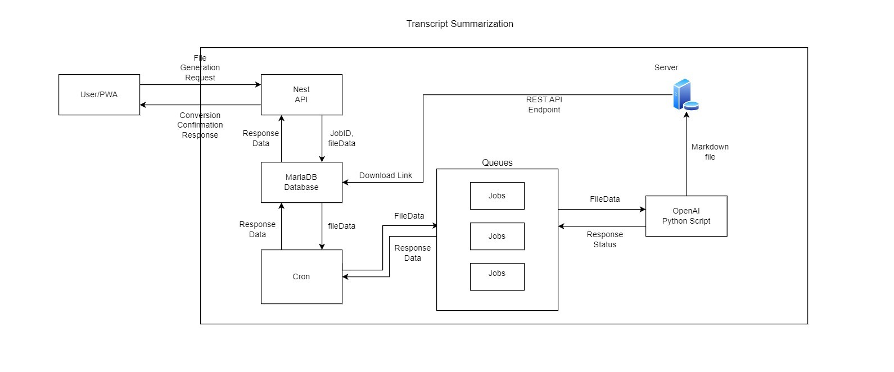

# **Block Diagram**

## **Introduction**

This document provides a concise block diagram illustrating the architecture of our software application, Transcript Summarization. The diagram outlines the key components and their interactions to help you better understand how the application functions.

**Block Diagram Overview:**

The block diagram represents the software application's architecture in a visual format, making it easier to grasp its structure and functionality.

**Block Diagram**

**Components and Functionalities**

1. **User/PWA**
    - This component is responsible for making the request to the transcript summarization API with a .vtt file uploaded by the user.

### **2\. GraphQL API**

    - The core component, created with NestJS, is responsible for accepting the incoming requests made by the user/application for creating a transcript summary.
    - A status response is sent back to the user/PWA to signify if the file has been successfully summarized or if any errors were encountered.
    - Upon receiving the request, the API stores the received job ID and other necessary details in the database.

### **3\. Database TypeORM**

- The MariaDB database is responsible for holding the records of uploaded transcripts along with all other required details about them such as the jobId, CreatedAt time, CreatedBy username etc.
The records in the database are updated with the summarized file download link received from the server upon conversion success.

### **4\. Cron Job Scheduler**

A scheduled cron fetches all the uploaded transcripts in the pending status from the database and adds their Job IDs to the queue for processing.

### **5\. Queue**

- A queue is maintained to allow processing of transcript records one by one.
- These queues are implemented using Bull Queue.
- The queue receives the Job ID of the transcript to be summarized and fetches its File data from the database using this Job ID to pass it onto the service.

### **6\. OpenAI Python Script**

- The script holds the business logic for generating the summary of the uploaded transcript.
- Upon success/failure, the response is sent back to update the status of the job ID

## Data Flow

- User interacts with the progressive web App to upload transcript files.
- NestJS backend receives the file upload request and enqueues a job in the Bull queue for transcript summarization.
- Cron job scheduler triggers a job every second
- The queue processor picks up jobs from the Bull queue and executes transcript summarization of the uploaded file using the OpenAI Python script.
- On success, summarized files are stored on a server, and a download link is generated using a REST API Endpoint which is stored in MariaDB database
- A download link through a REST API endpoint is made available for users to download the summarized file.

## **Conclusion**

This block diagram serves as a valuable resource for understanding the architecture of our software application. It highlights the core components, their interactions, and the flow of data within the application.