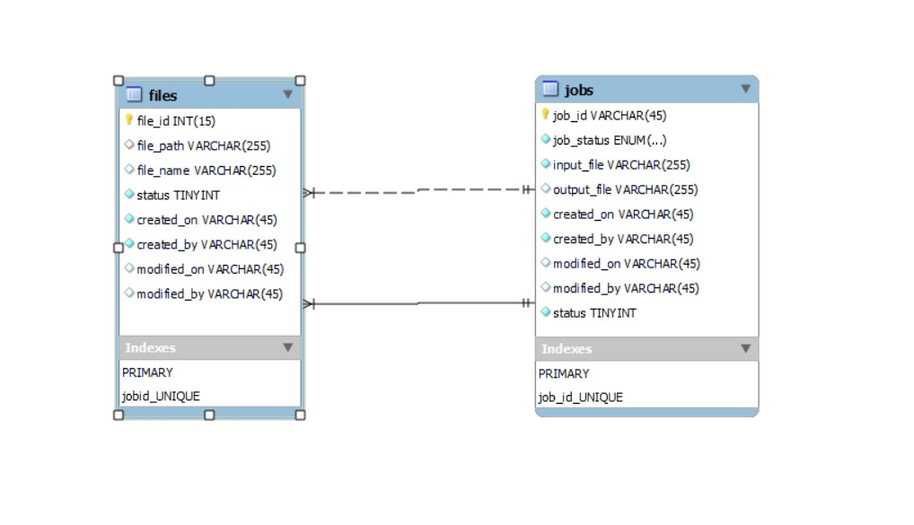

# **Database Design**

This document provides a comprehensive and structured overview of the database design for Transcript Summarization App.

It serves as a reference guide for stakeholders, including developers, database administrators, project managers, and other parties involved in the development, maintenance, and understanding of the application's database.

The tables discussed below will be created as part of the database migration.

## **Database Schema**

The database schema consists of the following 3 tables:

- **User_files :** Contains details about all the user uploaded files with their Task IDs.
- **job_logs** : Contains details about the queue system-related data, such as job metadata and status.

This schema can be visualized in the following image:

## **Data Dictionary**

### User Files

| Attribute | Data Type | Not Null | Default | Description |
| --- | --- | --- | --- | --- |
| task_id | int(11) | True |     | Primary key, unique identifier for the uploaded record |
| input_file_path | varchar(255) |     |     | File path of user uploaded file |
| output_file_path | varchar(255) |     |     | File path of summarized file stored in server after successful processing |
| output_file_name | varchar(255) |     |     | File name of summarized file stored in server after successful processing |
| status | tinyint | True |     | Stores the response status code of the response |
| created_on | timestamp | True | current_timestamp() | Stores the timestamp for the creation of the record |
| created_by | Varchar(45) | True | admin | Stores the details of creator of the record |
| modified_on | timestamp |     |     | Stores the timestamp for the last update to the record |
| modified_by | Varchar(45) |     |     | Stores the details of Modifier of the record |

**job_logs**

| Attribute | Data Type | Not Null | Default | Description |
| --- | --- | --- | --- | --- |
| job_id | int(11) | True |     | Primary key, unique identifier for the uploaded record |
| task_id | varchar(255) | True |     | Stores the ID value for related task_id |
| job_status | enum | True |     | Stores the job status for related job_id |
| input_file | varchar(255) |     |     | File path of user uploaded file |
| output_file | varchar(255) |     |     | File path of summarized file stored in server after successful processing |
| status | tinyint | True |     | Stores the active/inactive status of the record |
| created_on | timestamp | True | current_timestamp() | Stores the timestamp for the creation of the record |
| created_by | Varchar(45) | True | admin | Stores the details of creator of the record |
| modified_on | timestamp |     |     | Stores the timestamp for the last update to the record |
| modified_by | Varchar(45) |     |     | Stores the details of Modifier of the record |